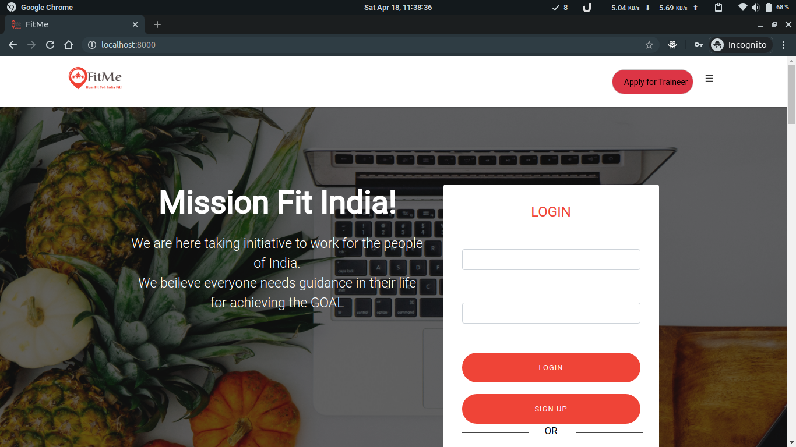

# FitMe

## Django

Django is an open-source python web framework used for rapid development, pragmatic, maintainable, clean design, and secures websites. A web application framework is a toolkit of all components need for application development. The main goal of the Django framework is to allow developers to focus on components of the application that are new instead of spending time on already developed components. Django is fully featured than many other frameworks on the market. It takes care of a lot of hassle involved in the web development; enables users to focus on developing components needed for their application.

## Virtualenv & Dependencies

create a virtualenv and run requirements.txt 
<b>virtualenv</b>

<pre>pip install virtualenv</pre>

<b> what is virtual environment ? </b> 
A virtual environment is a tool that helps to keep dependencies required by different projects separate by creating isolated python virtual environments for them. This is one of the most important tools that most of the Python developers use.
 
<a href="https://www.geeksforgeeks.org/python-virtual-environment/" >read more... </a>

to run requirements.txt

<pre>$ pip install -r requirements.txt</pre>
 
here <b>env/</b> folder contains all dependencies

## Features

<ul>
  <li>responsive bootstrap design </li>
  <li>Trainee and Trainer login and registration feature</li>
  <li>Task assignment and update </li>
  <li>dashboard with graphs and animations</li>
</ul>

## Contributing

Bug reports and pull requests are welcome on GitHub at https://github.com/itsvinayak/fitme 
